<!-- Profile README for github.com/DevrajBijpuria Visual language borrowed from portfoliodevraj.vercel.app: landing type lines → CRT desktop → engineering pinboard. Every SVG in /assets is generated; edit build.py and re-run rather than hand-editing. --> 
     
 
Select a line to open its section, same as on <a href="https://portfoliodevraj.vercel.app/">the site</a>.

  

  
 
📁 <code>programming</code>
   Python, SQL, C++, PySpark 
 
 
📁 <code>data_engineering</code>
   ETL/ELT pipelines, data ingestion and transformation, Change Data Capture (CDC), SCD Type 1 and 2, Apache Airflow, Kafka, dbt, Apache NiFi, Docker 
 
 
📁 <code>cloud_aws</code>
   Amazon S3, AWS Lambda, AWS Glue, Amazon Athena, Amazon CloudWatch, EC2, Oracle Cloud Infrastructure (OCI) 
 
 
📁 <code>databases</code>
   Snowflake (Snowpipe, Streams, Tasks), PostgreSQL, data warehousing, data modeling, relational database design, window functions 
 
 
📁 <code>analytics</code>
   pandas, NumPy, data cleaning, exploratory data analysis, statistics, data visualization, Power BI 
 
 
📁 <code>machine_learning</code>
   scikit-learn, XGBoost, tree-based models and ensembles, Isolation Forest, LLM apps with Gemini (RAG, text-to-SQL) 
  

 <a href="https://portfoliodevraj.vercel.app/"></a>

<a href="https://github.com/DevrajBijpuria/Zomato-DataPiple-Ai">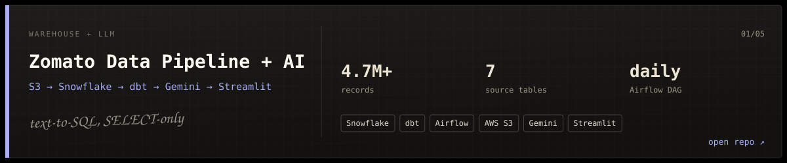</a>

 
<b>Open the notebook page</b>
  
COPY INTO
writes back
orchestrates
S3 raw
Snowflake RAW
dbt staging
dbt marts
Gemini enrichment
Streamlit: RAG chat
Streamlit: text-to-SQL
Airflow zomato_batch, daily
4.7M+ records across 7 tables (restaurants, users, food, menus, orders, order items, reviews).
Incremental dbt models with data-quality tests, from typed staging views to facts, dims and mart_* aggregates.
Gemini classifies every review by sentiment, topic and key issue; text-to-SQL is locked to SELECT-only queries.
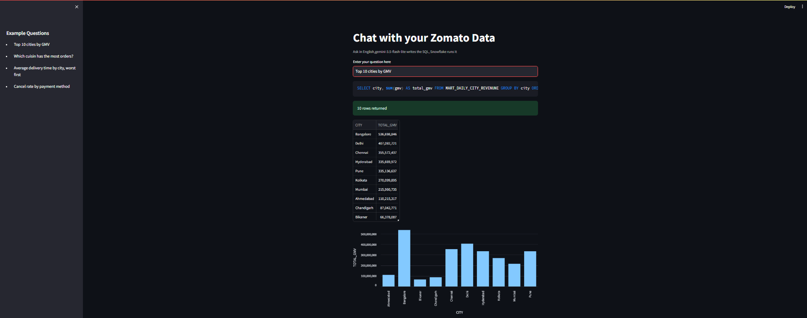 

<a href="https://github.com/DevrajBijpuria/REAL-TIME-DATA-PIPELINE">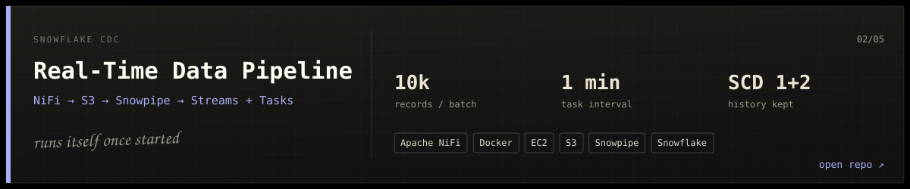</a>

 
<b>Open the notebook page</b>
  
PutS3Object
Snowpipe
task, SCD1
stream
task, SCD2
Faker CSV
NiFi on EC2, Docker
S3 external stage
customer_raw
customer
change-data view
customer_history
Zero manual steps once running: Snowpipe auto-ingests, two Tasks fire every minute.
SCD Type 1 keeps current state; SCD Type 2 keeps every change with start_time, end_time and is_current.
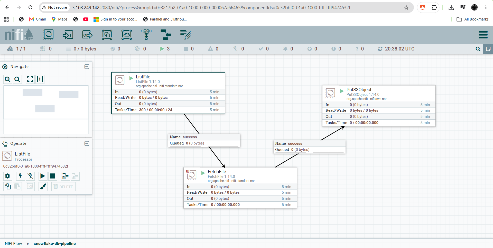 

<a href="https://github.com/DevrajBijpuria/Data_Pipeline_pro1">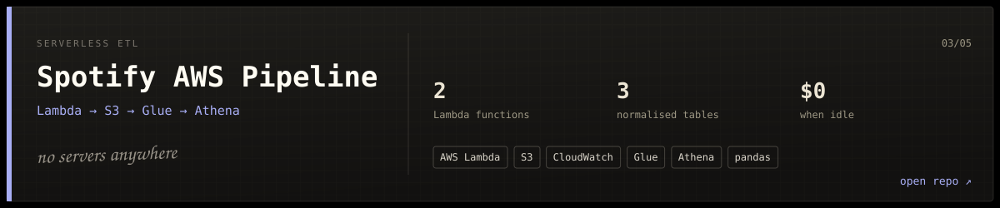</a>

 
<b>Open the notebook page</b>
  
object created
CloudWatch, daily
Lambda: extract
S3 raw JSON
Lambda: transform
S3 songs / albums / artists
Glue crawler + catalog
Athena SQL
Fully serverless, so an idle day costs nothing.
One playlist payload becomes three deduplicated tables; raw JSON is archived, never overwritten.
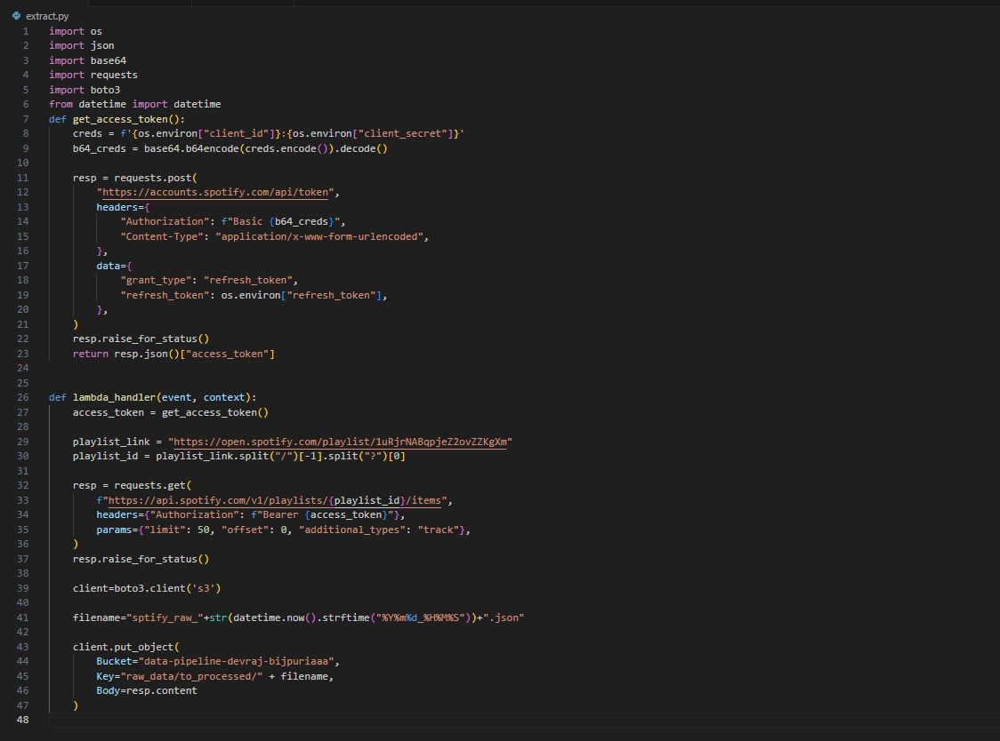 

<a href="https://github.com/NihalGeek/NNNIDS">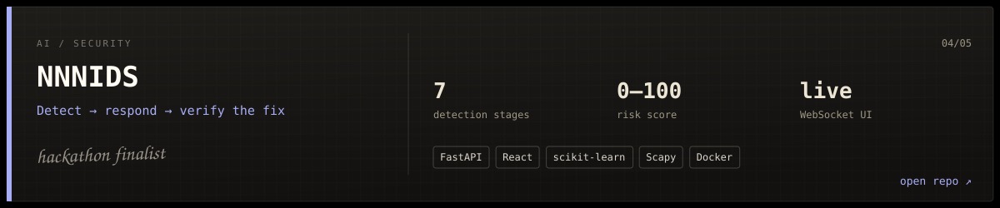</a>

 
<b>Open the notebook page</b>
  
WebSocket
Scapy capture
Features
Signatures
Isolation Forest
Behavioral baseline
Threat intel
Risk score 0-100
Block / throttle / monitor
Verify the fix
React dashboard
Hybrid 7-stage pipeline: rules, ML anomaly detection and behavioral heuristics in one pass.
Blocks IPs through the OS firewall (netsh or iptables), then measures whether the block actually worked.
NextGen Hackathon finalist.
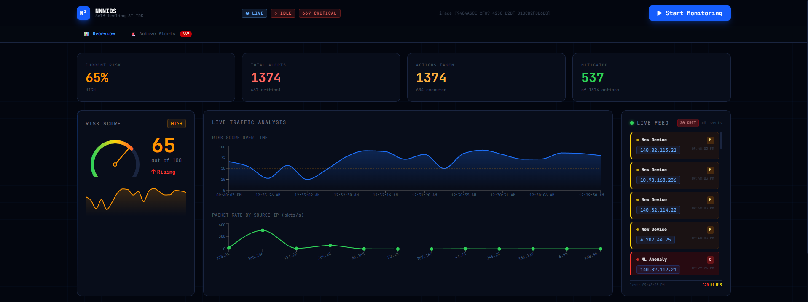 

<a href="https://github.com/DevrajBijpuria/signal-desk">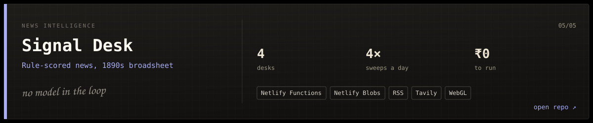</a>

 
<b>Open the notebook page</b>
  
edge-cached read
cron, 4x a day
fetch, dedupe, score, tag
Netlify Blobs
/api/news
Broadsheet front page
Every story gets a legitimacy score from source tiers plus corroboration, with the reason printed next to it.
Page loads never touch a feed, so it runs on Netlify's free tier at zero cost.
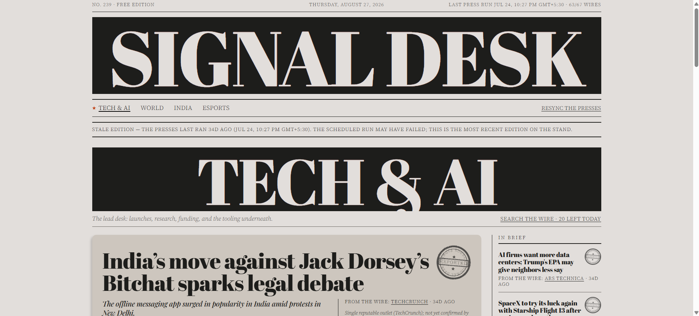 
  

 
 <a href="mailto:dbijpuria@gmail.com">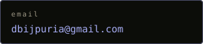</a> <a href="https://linkedin.com/in/devraj-bijpuria">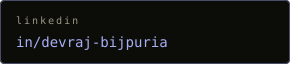</a> <a href="https://portfoliodevraj.vercel.app/">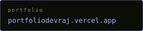</a> <a href="https://portfoliodevraj.vercel.app/DEVRAJ_BIJPURIA_RESUME.pdf">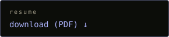</a> 
 
 
<code>git log --graph</code>
    
 
