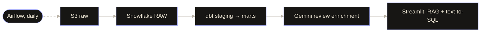
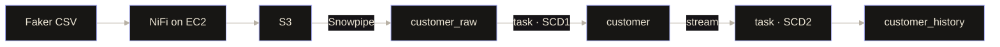
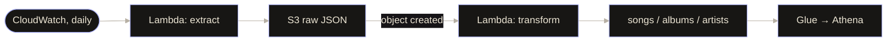
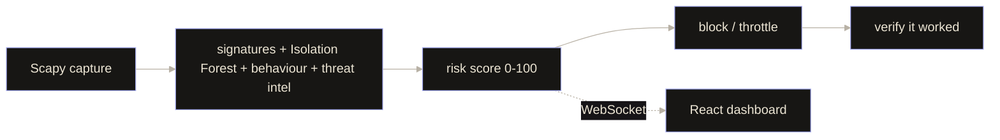
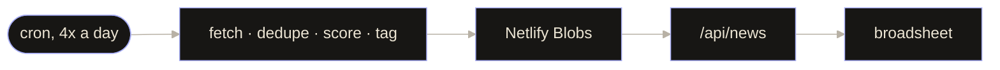

<!-- Inspired by portfoliodevraj.vercel.app: black stage, cream type, periwinkle accent, handwritten notes. No asset folder needed. -->

<a href="https://portfoliodevraj.vercel.app/">
  
</a>

<p align="center">
  
</p>

<p align="center">
  <a href="#about"><code>about</code></a>&nbsp;&nbsp;
  <a href="#skill-sets"><code>skill sets</code></a>&nbsp;&nbsp;
  <a href="#projects"><code>projectssss</code></a>&nbsp;&nbsp;
  <a href="#contact"><code>contact</code></a>
</p>

<br>

## about

```text
sys/about ─────────────────────────────────────────────────────────────
  Devraj Bijpuria · Computer Science @ VIT Bhopal · class of 2027

  I got into data engineering after wondering what actually happens to
  data before it reaches an ML model. That rabbit hole led me into
  pipelines, AWS, Snowflake, ETL/ELT, real-time systems and analytics.

  verified
  ✦ AWS Certified Cloud Practitioner ............ Amazon     Aug 2026
  ✦ Generative AI Professional .................. Oracle     Jul 2025
  ✦ SC-900 Security, Compliance & Identity ...... Microsoft  Jun 2025
────────────────────────────────────────────────────────────────────────
```

## skill sets

<details open>
<summary>📁 <code>data_engineering</code></summary>
<br>


</details>

<details>
<summary>📁 <code>cloud_and_warehouse</code></summary>
<br>


</details>

<details>
<summary>📁 <code>code_and_analysis</code></summary>
<br>


</details>

## projects

> *pinned to the board — click a name to open the repo, the arrow to open its page*

### [Zomato Data Pipeline + AI](https://github.com/DevrajBijpuria/Zomato-DataPiple-Ai)
`S3 → Snowflake → dbt → Gemini → Streamlit` &nbsp; *— 4.7M+ records, text-to-SQL that only ever SELECTs*

<details>
<summary>open the notebook page</summary>


7 source tables, incremental dbt models with data-quality tests, Gemini tags every review by sentiment, topic and key issue.
</details>

### [Real-Time Data Pipeline](https://github.com/DevrajBijpuria/REAL-TIME-DATA-PIPELINE)
`NiFi → S3 → Snowpipe → Streams + Tasks` &nbsp; *— runs itself once started*

<details>
<summary>open the notebook page</summary>


10k records per batch, Tasks every minute, full change history with `start_time`, `end_time`, `is_current`.
</details>

### [Spotify AWS Pipeline](https://github.com/DevrajBijpuria/Data_Pipeline_pro1)
`Lambda → S3 → Glue → Athena` &nbsp; *— no servers anywhere, costs nothing when idle*

<details>
<summary>open the notebook page</summary>


One playlist payload in, three deduplicated tables out; raw JSON archived, never overwritten.
</details>

### [NNNIDS](https://github.com/NihalGeek/NNNIDS)
`detect → respond → verify the fix` &nbsp; *— NextGen Hackathon finalist*

<details>
<summary>open the notebook page</summary>


7-stage hybrid detection, OS-firewall response through `netsh` / `iptables`, live dashboard.
</details>

### [Signal Desk](https://github.com/DevrajBijpuria/signal-desk)
`rule-scored news in an 1890s broadsheet` &nbsp; *— no model in the loop, ₹0 to run*

<details>
<summary>open the notebook page</summary>


Legitimacy score from source tiers plus corroboration, with the reason printed on every story.
</details>

## contact

<a href="mailto:dbijpuria@gmail.com"></a>
<a href="https://linkedin.com/in/devraj-bijpuria"></a>
<a href="https://portfoliodevraj.vercel.app/"></a>

<br><br>

<p align="center">
  
</p>
